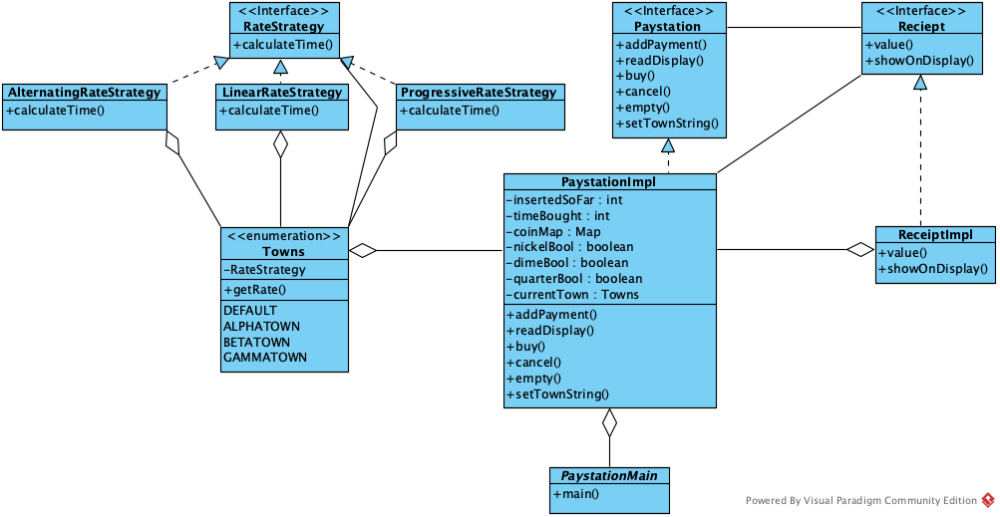

# PayStation - Rate Strategies

## Requirements
The requirements for this project were to take the basic skeleton of the Pay Station itself and add a user interface which will act as a physical representation of a single ticket machine. The technical requirements were to implement the UI (terminal), follow accurate TDD procedures, and to collaborate as a team of two. Communication and git "branches" were key to organizing this assignment. We implemented everything that was asked of us in the project details / description. All of our tests pass, follow TDD, and our main loop contains zero known bugs.

Our implementation of the three rate strategies was a mixture of the polymorphic and compositional models. We used inheritance from the RateStrategy class in the three superceding classes and used the compositinal model for the main loop where we access the different rates. We chose these two models because they seemed to work best for the use case that we needed to fit them into and because the first two models were completely unfit for use in this project.

## Team Work
The collaboration between the two of us consisted of text messages communicating our progress on respective branches. When we were finished with the implementation and testing of a certain branch or feature, we would push it to GitHub and then submit a pull request for the other person to look over, comment on, and then either accept and merge into 'master' or deny.

### Paul Pesnell:
I worked first on building the RateStrategy interface to allow for that flexibility and code reuse. I then worked on an enum to hold the towns which further encompassed the rate strategies. I further worked on the implementation of the main method for interaction with the paystation. I also worked on building tests surrounding additional methods added to help with the functionality of the enum and other methods. I reviewed the pull requests of Chris to make sure that the methods at least visually matched their description and then would continue to run the new test suite whenever I was furthering the development.

### Chris Bilger:
I implemented the functionality and testing of the ProgressiveRateStrategy and AlternatingRateStrategy classes. I also organize the functionality of the program into a separate package from the testing to keep associated files together. As well as that, I implemented the displaying of the cancel values and the receipt in the terminal.

As far as coding, it seemed more or less like we each submitted half of the code; however, we wanted to finish the project ahead of time so we were quick to push new features and testing. For the TDD side of the project, we each implemented the tests for our own produced code, and then we checked that the new code / tests didn't interfere with previously existing code / tests. There was a null-pointer exception that Paul found on Chris' commit; however, I (Chris) don't think that was an error with the implementation, but moreso the differences between our working environments.

## Testing
We implemented unit testing on as much of the new features that we felt needed it. All of our tests are automated, and we started with automated tests in mind from the beginning so no, our tests did not require part of the program to be changed in order to implement them. Our functions were simple enough to not produce many bugs apart from the null-pointer exception noted above. Each individual person created the tests that ran on their respective feature / code. The tests that we devised were written prior to riting the code that would be tested.
